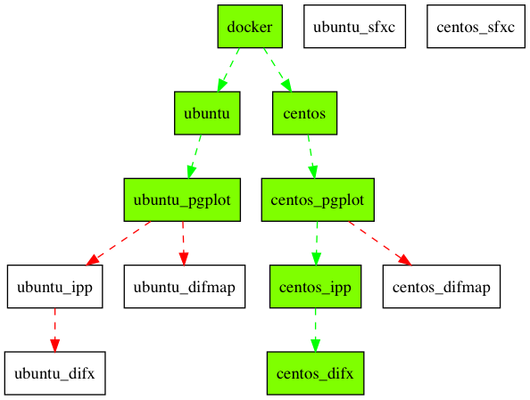

# ASOD

```
    _      ____     ___    ____
   / \    / ___|   / _ \  |  _ \
  / _ \   \___ \  | | | | | | | |
 / ___ \   ___) | | |_| | | |_| |
/_/   \_\ |____/   \___/  |____/

```

ASOD is the abbreviation of **A**stro**S**oft **O**n **D**ocker.

Any problem , send email to me [郭大侠](https://github.com/shaoguangleo) <sgguo@shao.ac.cn> @ [上海天文台](http://www.shao.ac.cn)

# Introduction

This git repo will hold all the related astrosoft dockers.

致力于精简所有天文流行软件的安装，只需一条命令即可使用复杂的可能要花上几天来安装的软件。

上一个版本主要基于源码安装，操作有些复杂，详细的脚本可以参考old目录。

最新版本基于Docker，只需`docker run`即可享用相应软件。

# Support OS and Software

All the docker images can run on the following OS:

- Ubuntu
- CentOS
- MacOSX
- Other Linux Distro is support


# Docker

|     | Ubuntu     |  CentOS    |  Comment |
|----|-----|-----|-----|
|basic| [shaoguangleo/ubuntu](https://hub.docker.com/r/shaoguangleo/ubuntu/)| [shaoguangleo/centos](https://hub.docker.com/r/shaoguangleo/centos/)| 基于CentOS7.4及Ubuntu17.10版本|
|pgplot| [shaoguangleo/ubuntu-pgplot](https://hub.docker.com/r/shaoguangleo/ubuntu-pgplot/)| [shaoguangleo/centos-pgplot](https://hub.docker.com/r/shaoguangleo/centos-pgplot/)| PGPLOT镜像 |
|tempo| |||
|tempo2||||
|sigproc||||
|presto||||
|psrcat||||
|cfitsio||||
|calceph||||
|psrchive||||
|dspsr||||
|DiFX||||
|SFXC||||
|Difmap||||

## Current relationship

