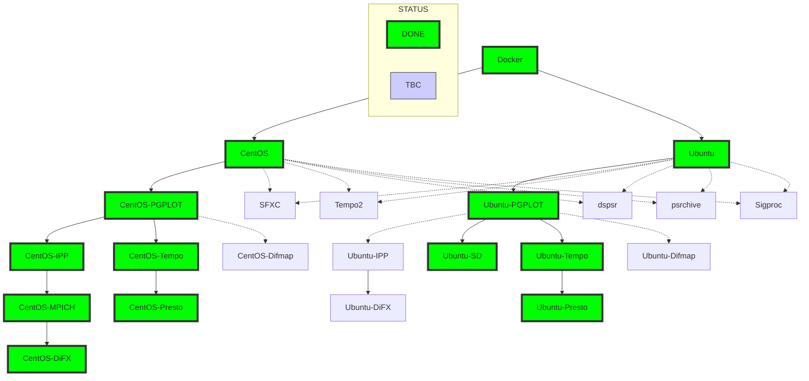

```mermaid
graph TD;
    Docker --> CentOS;
    Docker --> Ubuntu;


    CentOS --> CentOS-PGPLOT;

    CentOS-PGPLOT --> CentOS-IPP;
    CentOS-PGPLOT --> CentOS-Tempo;

    CentOS-IPP --> CentOS-MPICH;
    CentOS-MPICH --> CentOS-DiFX;
    CentOS-Tempo --> CentOS-Presto;

    Ubuntu --> Ubuntu-PGPLOT;

    Ubuntu-PGPLOT -.-> Ubuntu-IPP;
    Ubuntu-PGPLOT --> Ubuntu-SD;
    Ubuntu-PGPLOT --> Ubuntu-Tempo;

    Ubuntu-IPP --> Ubuntu-DiFX;
    Ubuntu-Tempo --> Ubuntu-Presto;

    CentOS -.-> SFXC;
    Ubuntu -.-> SFXC;
    CentOS -.-> Tempo2;
    Ubuntu -.-> Tempo2;
    CentOS-PGPLOT -.-> CentOS-Difmap;
    Ubuntu-PGPLOT -.-> Ubuntu-Difmap;
    CentOS -.-> dspsr;
    Ubuntu -.-> dspsr;
    CentOS -.-> psrchive;
    Ubuntu -.-> psrchive;
    CentOS -.-> Sigproc;
    Ubuntu -.-> Sigproc;

%% The color status  %%
    style Docker fill:#0f0,stroke:#333,stroke-width:4px;

    style CentOS fill:#0f0,stroke:#333,stroke-width:4px;
    style CentOS-PGPLOT fill:#0f0,stroke:#333,stroke-width:4px;
    style CentOS-IPP fill:#0f0,stroke:#333,stroke-width:4px;
    style CentOS-MPICH fill:#0f0,stroke:#333,stroke-width:4px;
    style CentOS-DiFX fill:#0f0,stroke:#333,stroke-width:4px;
    style CentOS-Tempo fill:#0f0,stroke:#333,stroke-width:4px;
    style CentOS-Presto fill:#0f0,stroke:#333,stroke-width:4px;

    style Ubuntu fill:#0f0,stroke:#333,stroke-width:4px;
    style Ubuntu-PGPLOT fill:#0f0,stroke:#333,stroke-width:4px;
    style Ubuntu-SD fill:#0f0,stroke:#333,stroke-width:4px;
    style Ubuntu-Tempo fill:#0f0,stroke:#333,stroke-width:4px;
    style Ubuntu-Presto fill:#0f0,stroke:#333,stroke-width:4px;


    subgraph STATUS
    DONE
    TBC
    style DONE fill:#0f0,stroke:#333,stroke-width:4px;
    style TBC fill:#ccf,stroke:#333,stroke-width:1px;
    end
```

